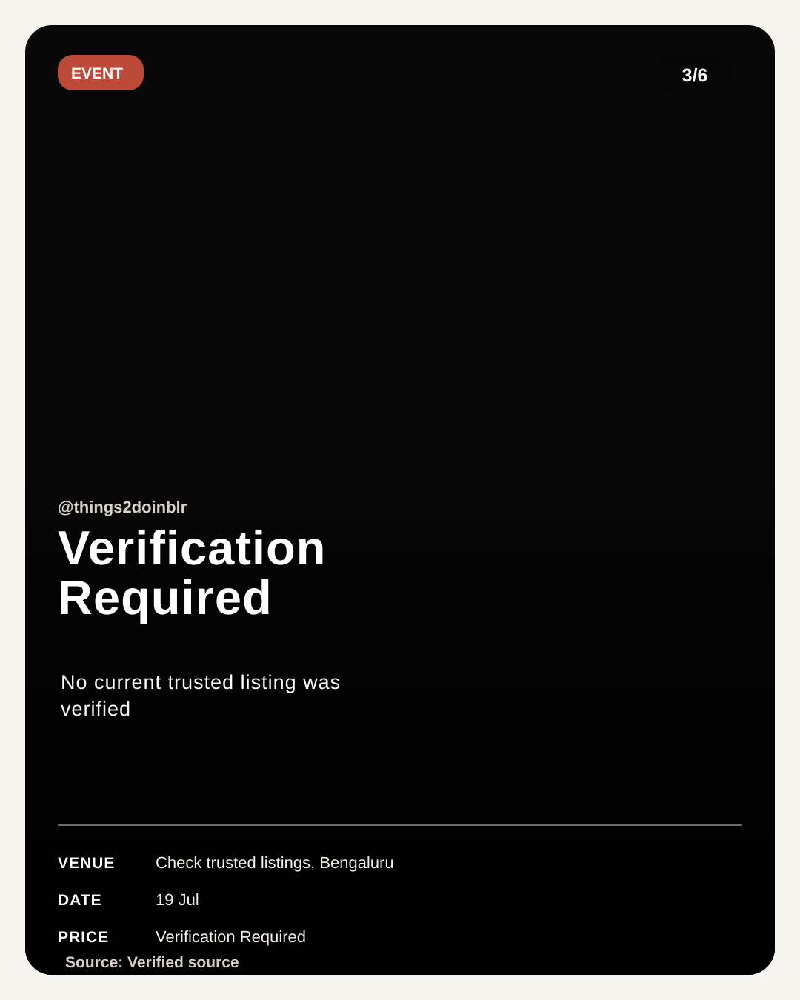

# Carouselsmith AI

Carouselsmith AI turns a topic, URL, source text, PDF, or reference screenshot into a researched, design-aware social carousel.

It is built for creators, agencies, and social teams who want to move from a rough brief to publish-ready Instagram or LinkedIn slides without losing factual accuracy or visual consistency.

## What It Does

- Researches a prompt with source-aware planning.
- Improves rough prompts before generation.
- Learns visual direction from uploaded screenshots or PDFs.
- Generates a cohesive slide plan, caption, hashtags, sources, and fact checks.
- Keeps specialty layouts consistent, including tweet-style and event-poster-style carousels.
- Saves previous generations with short, readable history notes.
- Exports all carousel slides as PNGs in a ZIP for manual posting.

## Product Flow


## Generated Carousel Examples

These are local examples from the current renderer output.

| Cover | Event Slide | Verification Slide |
| --- | --- | --- |
|  |  |  |

The product intentionally separates visual generation from text rendering for data-heavy posts. Images can be generated or sourced, but titles, dates, prices, venues, counters, handles, and source notes are placed by code so they remain readable and consistent.

## Key Screens

- **Home**: simple product explanation and example workflow.
- **Composer**: topic, handle, source text, slide count, prompt improver, and reference uploads.
- **Preview**: generated slide carousel with active-slide download.
- **Intelligence**: research summary, plan, sources, fact checks, and caption.
- **History**: saved generations with short notes, reload support, and delete.
- **Publish**: editable caption box and export controls.

## Local Setup

Install dependencies:

```bash
npm install
```

Create a local `.env` file from the example:

```bash
cp .env.example .env
```

Fill in whichever providers you want to use:

```bash
GEMINI_API_KEY=
OPENAI_API_KEY=
TEXT_PROVIDER=gemini
IMAGE_PROVIDER=gemini
IMAGE_FALLBACK_PROVIDER=openai
```

Run the API and client in two terminals:

```bash
npm run server
npm run client
```

Open the app:

[http://127.0.0.1:5173](http://127.0.0.1:5173)

The API runs on:

[http://127.0.0.1:8787](http://127.0.0.1:8787)

## Scripts

```bash
npm run server
npm run client
npm test
npm run build
npm run migrate:turso
```

## Environment Variables

| Variable | Purpose |
| --- | --- |
| `GEMINI_API_KEY` | Gemini text/image generation key |
| `GEMINI_TEXT_MODEL` | Gemini text model, currently `gemini-3.1-flash-lite` |
| `GEMINI_IMAGE_MODEL` | Gemini image model, currently `gemini-3-pro-image` |
| `OPENAI_API_KEY` | Optional OpenAI fallback key |
| `OPENAI_TEXT_MODEL` | Optional OpenAI text model |
| `OPENAI_IMAGE_MODEL` | Optional OpenAI image model |
| `TEXT_PROVIDER` | Primary text provider |
| `IMAGE_PROVIDER` | Primary image provider |
| `IMAGE_FALLBACK_PROVIDER` | Optional image fallback provider |
| `AUTH_SECRET` | JWT signing secret |
| `SMTP_HOST` | SMTP server for verification emails; unset logs codes to the console |
| `SMTP_PORT` | SMTP port (587 STARTTLS, 465 implicit TLS) |
| `SMTP_USER` | SMTP username |
| `SMTP_PASSWORD` | SMTP password or app password |
| `MAIL_FROM` | From address on verification emails |
| `TURSO_DATABASE_URL` | Turso database URL; enables shared durable storage |
| `TURSO_AUTH_TOKEN` | Turso auth token |
| `DB_PATH` | Optional SQLite path. On Vercel this defaults to `/tmp/carouselsmith.sqlite` |
| `GENERATED_DIR` | Optional generated slide directory. On Vercel this defaults to `/tmp/carouselsmith-generated` |
| `PORT` | API port |
| `APP_URL` | Frontend URL |
| `API_URL` | Backend URL |

Social publishing variables are also available in `.env.example` for future LinkedIn and Instagram integrations.

## Tech Stack

- React 19
- Vite
- Express
- SQLite
- Gemini via `@google/genai`
- Optional OpenAI fallback
- Sharp for PNG export
- Node test runner

## Notes

- Signup requires email verification. The account is created unverified, a 6-digit code is emailed, and no session token is issued until `/auth/verify-email` succeeds. Codes are stored only as HMACs, expire in 10 minutes, allow 5 attempts, and are single-use. Signin is password-only once the address is confirmed.
- Disposable-email domains are rejected at signup. Accounts that existed before verification shipped are grandfathered as verified by a one-time migration.
- Without SMTP configured the app prints codes to the server console so local development works; in production a missing SMTP host is a startup error rather than a silent non-delivery.

- Generated carousels are stored locally and can be reloaded from history.
- Downloaded ZIPs contain PNG slides plus caption text.
- The app avoids mock carousel fallbacks in production paths; provider or billing failures are surfaced as real errors.
- For time-sensitive prompts, such as events happening in the next 5 days, the pipeline asks the model to verify current dates and trusted sources before rendering.
- Deployed history is stored in Turso (libSQL). Set `TURSO_DATABASE_URL` and `TURSO_AUTH_TOKEN` and every serverless instance reads and writes the same durable database. Without them the app falls back to a local SQLite file.
- Carousels are addressed by a UUID `public_id`, never by the SQLite row id. Row ids are only unique within one database file, so a serverless instance that booted from a different snapshot could otherwise return a different carousel for the same id.
- Generated slide image files are still written to the local filesystem (`/tmp` on Vercel), so images from an older deploy can 404 even though the carousel record itself survives. Moving them to S3/R2/Vercel Blob is the remaining piece.
